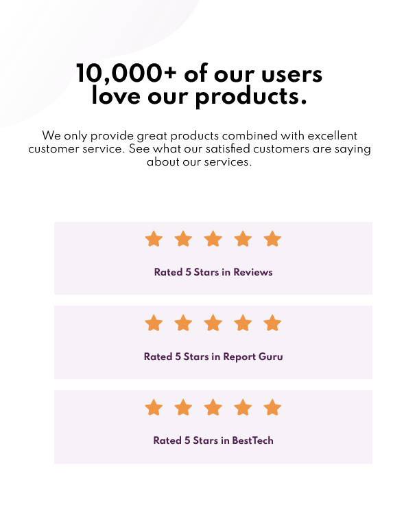

# Frontend Mentor - Social proof section solution

This is a solution to the Social proof section challenge on Frontend Mentor (https://www.frontendmentor.io/challenges/social-proof-section-6e0qTv_bA.) Frontend Mentor challenges help you improve your coding skills by building realistic projects. 

## Table of contents

- [Overview](#overview)
  - [The challenge](#the-challenge)
  - [Screenshot](#screenshot)
  - [Links](#links)
- [My process](#my-process)
  - [Built with](#built-with)
  - [What I learned](#what-i-learned)
  - [Continued development](#continued-development)
  - [Useful resources](#useful-resources)
- [Author](#author)
- [Acknowledgments](#acknowledgments)


## Overview

### The challenge

Users should be able to:

- View the optimal layout for the section depending on their device's screen size

### Screenshot




### Links

- Solution URL: https://github.com/zitsko/social-proof-section
- Live Site URL: https://zitsko.github.io/social-proof-section/

## My process
I started off with the markup grouping elements with div and lists  for  applying flexbox and grid in css. Then i created variables for colors,fonts and borders in the root element.My approach was mobile first using grid combined with flexbox and then the desktop design using a media query.

### Built with

- Semantic HTML5 markup
- CSS custom properties(variables)
- Flexbox
- CSS Grid
- Mobile-first workflow

### What I learned

 I have learned: 
 - important units like rem,em for responsiveness and a new unit like ch for words and sentences
 - declaring variables in the root element 
 - using CSS Grid and Flexbox although i have a lot to learn still
 - using aria labels for accesibility reasons(in the code below the stars are hidden for the screen readers)
 ```html
<div class="stars" aria-hidden="true">
```
 - The > * + * selector for selecting the elements after the first element and giving margins with consistency. The code below is giving margin-top 1 rem on the second and the third li element.
```css
.flow-content > * + *{
margin-top: 1rem;
}
```

### Continued development
CSS Grid and Flexbox and SASS are  areas i want to focus for building responsive layouts. Also Javascript is my next area of web development and how to manipulate the markup and the styles with DOM so i can can become a front end wed development. In the future i want to learn a Javascript library like React and how to interact websites with APIs. 

### Useful resources

- [Kevin Powell](https://youtu.be/K27WULzr2P8?list=PL3zBJqt8nv1Juf9j6kCt-uWoOmmbyEumO) - Kevin Powell is an excellent teacher for learning css. His approach in this challenge helped me a lot and teached me basic concepts of css. Additionally, Kevin is using SASS in his solution something i did not use in mine  but seeing how sass can organize your code now i want to learn SASS!
- [Scrimba](https://scrimba.com/) - Scrimba is an amazing platform for learning frontend web development. I am currently learning by their FrontEnd Developer Carrer Path
- [MDN](https://developer.mozilla.org/en-US/) - MDN is a great resource for frontend web development.


## Author
- Frontend Mentor - [@Kostas](https://www.frontendmentor.io/profile/zitsko)


